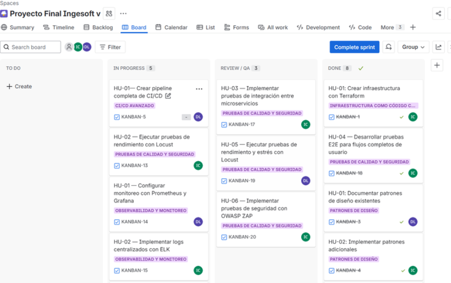
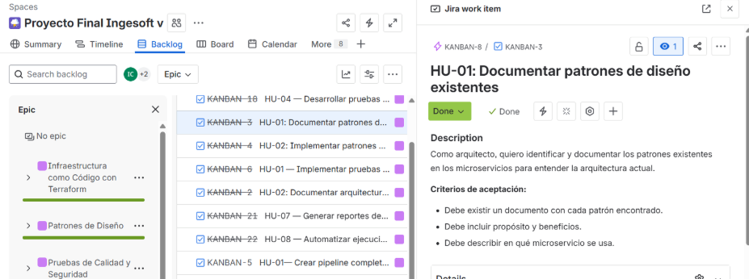
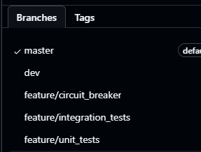

# Metodología Ágil y Estrategia de Branching

## Metodología Ágil: Kanban

Para el desarrollo del proyecto utilizamos la metodología ágil **Kanban**, que nos permitió visualizar el flujo de trabajo, priorizar tareas y adaptarnos rápidamente a los cambios. Usamos **Jira** como tablero para gestionar las tareas, historias de usuario y sprints.

- Se documentaron historias de usuario y criterios de aceptación.
- El tablero Kanban facilitó la colaboración y la transparencia en el equipo.

## Estrategia de Branching: GitHub Flow

Adoptamos **GitHub Flow** como estrategia de branching:
- Todo el desarrollo se realizó en ramas feature a partir de `main/master`.
- Cada feature se integró mediante Pull Requests, revisadas por el equipo.
- Se realizaron pruebas automáticas antes de cada merge.
- Los despliegues se automatizaron desde la rama principal.

## Herramientas
- **Jira** para gestión ágil.
- **Git** y **GitHub** para control de versiones y branching.

---
[Volver al README principal](../README.md)
